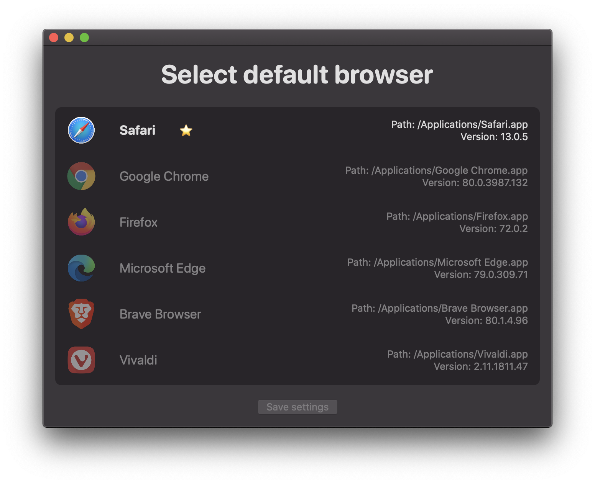

# DefaultBrowser

DefaultBrowser is a demo SwiftUI app for changing default browser on macOS.

Note! DefaultBrowser displays installed browsers that can be found on the incomplete list of common macOS browsers (`browsers.json`).

## Requirements

- Minimum macOS version: 10.15

## Launch Services

DefaultBrowser uses Launch Services API for changing default browser and modifies `http` and `https` URL scheme handlers.

### Deprecation warnings

 - 'LSCopyDefaultHandlerForURLScheme' was deprecated in macOS 10.15: Use LSCopyDefaultApplicationURLForURL() instead.
 - 'LSCopyAllHandlersForURLScheme' was deprecated in macOS 10.15: Use LSCopyApplicationURLsForURL() instead.